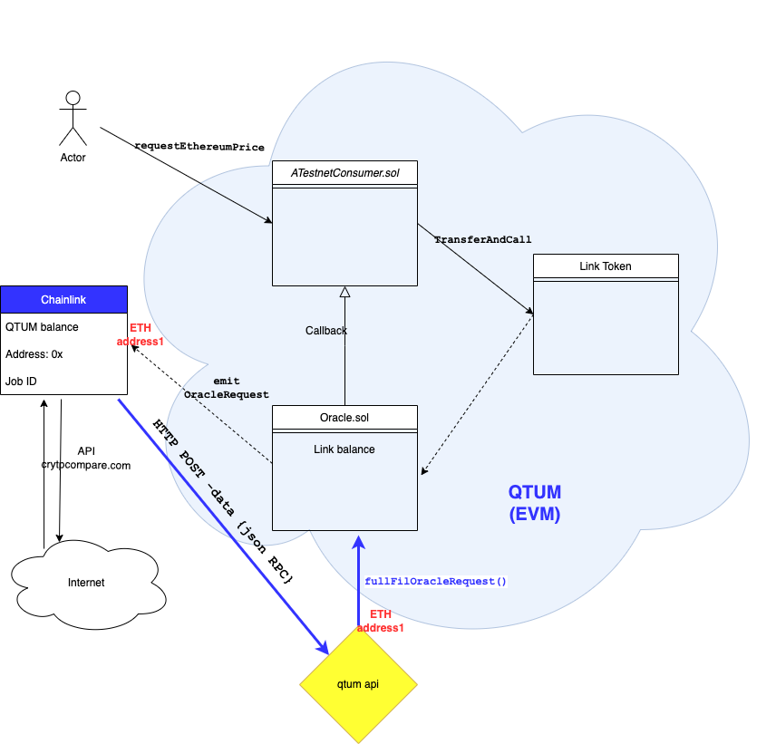

# api



# jobs

- GANACHE

```toml
type = "directrequest"
schemaVersion = 1
name = "Send price v3"
externalJobID = "8d0e8765-3b29-4acf-a140-6eb30e01ce48"
maxTaskDuration = "0s"
contractAddress = "0x97Af85c9Ef560874ea11FbC931D8f11dfD8b83dF"
minIncomingConfirmations = 0
observationSource = """
    decode_log   [type="ethabidecodelog"
                  abi="OracleRequest(bytes32 indexed specId, address requester, bytes32 requestId, uint256 payment, address callbackAddr, bytes4 callbackFunctionId, uint256 cancelExpiration, uint256 dataVersion, bytes data)"
                  data="$(jobRun.logData)"
                  topics="$(jobRun.logTopics)"]

    decode_cbor  [type="cborparse" data="$(decode_log.data)"]
    fetch        [type="http" method=GET url="$(decode_cbor.get)"]
    parse       [type="jsonparse" path="$(decode_cbor.path)" data="$(fetch)"]
    post         [type="http" method=POST url="http://127.0.0.1:3000/api/ganache" allowUnrestrictedNetworkAccess=true 
requestData="{\\"price\\": $(parse), \\"requestId\\": $(decode_log.requestId), \\"payment\\": $(decode_log.payment), \\"callbackAddress\\": $(decode_log.callbackAddr), \\"callbackFunctionId\\": $(decode_log.callbackFunctionId), \\"expiration\\": $(decode_log.cancelExpiration)}"]

     decode_log -> decode_cbor -> fetch -> parse -> post
"""
```

- QTUM


```toml
type = "directrequest"
schemaVersion = 1
name = "Send price v1"
externalJobID = "ebbac656-22f5-4a8d-bee2-bcb8328837ca"
maxTaskDuration = "0s"
contractAddress = "0x7fD9A5E7a38CC396609cf389364e9504F14A5ee6"
minIncomingConfirmations = 0
observationSource = """
    decode_log   [type="ethabidecodelog"
                  abi="OracleRequest(bytes32 indexed specId, address requester, bytes32 requestId, uint256 payment, address callbackAddr, bytes4 callbackFunctionId, uint256 cancelExpiration, uint256 dataVersion, bytes data)"
                  data="$(jobRun.logData)"
                  topics="$(jobRun.logTopics)"]

    decode_cbor  [type="cborparse" data="$(decode_log.data)"]
    fetch        [type="http" method=GET url="$(decode_cbor.get)"]
    parse       [type="jsonparse" path="$(decode_cbor.path)" data="$(fetch)"]
    post         [type="http" method=POST url="http://127.0.0.1:3000/api/qtum/" allowUnrestrictedNetworkAccess=true 
requestData="{\\"price\\": $(parse), \\"requestId\\": $(decode_log.requestId), \\"payment\\": $(decode_log.payment), \\"callbackAddress\\": $(decode_log.callbackAddr), \\"callbackFunctionId\\": $(decode_log.callbackFunctionId), \\"expiration\\": $(decode_log.cancelExpiration)}"]

     decode_log -> decode_cbor -> fetch -> parse -> post
"""
```